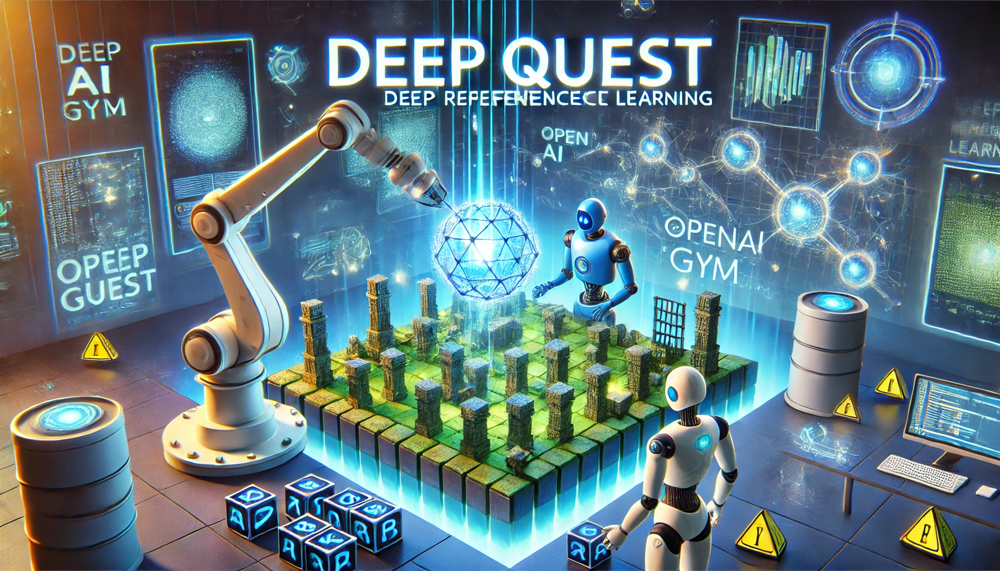

---

# DeepQuest: Deep Reinforcement Learning with OpenAI Gym

## Project Overview

DeepQuest is a deep reinforcement learning project utilizing OpenAI Gym to develop and train intelligent agents. The goal of this project is to provide a robust framework for designing, training, and evaluating reinforcement learning algorithms in a variety of environments.




## Features

- **Integration with OpenAI Gym**: Seamless interaction with various environments provided by OpenAI Gym.
- **Modular Structure**: Organized into `agents`, `environments`, `models`, and `visualization` modules.
- **Performance Evaluation**: Tools for monitoring and analyzing agent performance.
- **Visualization**: Graphical representation of training results.

## Getting Started

### Prerequisites

- Python 3.x
- OpenAI Gym
- TensorFlow / PyTorch (depending on your preference)
- Other necessary libraries: numpy, pandas, matplotlib

### Installation

1. Clone the repository:
   ```bash
   git clone https://github.com/yourusername/DeepQuest.git
   ```
2. Navigate to the project directory:
   ```bash
   cd DeepQuest
   ```
3. Install dependencies:
   ```bash
   pip install -r requirements.txt
   ```

## Project Structure

- `agents/`: Module for defining custom reinforcement learning agents.
  - `intelligent_agent.py`: Implements a deep reinforcement learning agent using neural networks.
  - `random_agent.py`: A simple baseline agent that acts randomly in the environment.
- `environments/`: Module for handling different OpenAI Gym environments.
- `models/`: Module for defining and training neural network architectures.
- `visualization/`: Module for creating visual representations of training results.
- `requirements.txt`: List of dependencies.

## Agent Details

### intelligent_agent.py

`intelligent_agent.py` defines a deep reinforcement learning agent using neural networks. Key components include:

- **Model Architecture**: Defines a neural network for state-action mapping.
- **Training Functionality**: Implements policy optimization and reward handling.
- **Environment Integration**: Interacts with OpenAI Gym environments for training and evaluation.

### random_agent.py

`random_agent.py` provides a simple agent that acts randomly in the environment. Key components include:

- **Random Action Selection**: Implements random decision-making in the environment.
- **Environment Interaction**: Utilizes OpenAI Gym for environment simulation.


## Contribution

Feel free to contribute by submitting pull requests or suggesting improvements!

---
